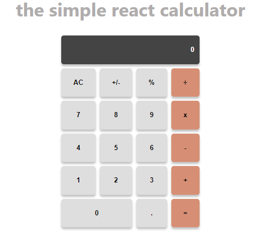

# Calculator App

> This is a Calculator application built with react.js.



It utilizes reacts Class components to function and implement its various features.

## Built With

- JavaScript
- `Array.map()`method.
- `Objects`
- Destructuring assignment

- CSS
- `Box-Shadow` property.
- `Grid` property.
- `Overflow`property.

- React
- `EventListeners` such as `onClick`.
- React `setState` method
- React controlled component.

- JSX


- Install Dependencies

```bash
npm install
```

To run StyleLint by itself, you may run the lint task:

```bash
npm run lint:check
```

Or to automatically fix issues found (where possible):

```bash
npm run lint
```

You can also check against Prettier:

```bash
npm run format:check
```

and to have it actually fix (to the best of its ability) any format issues, run:

```bash
npm run format
```

You can also check against HTML Validator:

```bash
npm run html-validator
```


